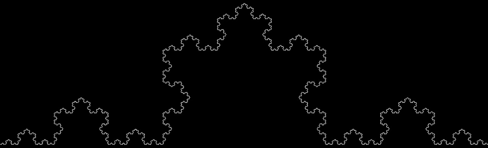

# Koch curve drawing program
I used the [Arcade library](https://github.com/pythonarcade/arcade) to write this program.



Below you will find two functions that I wrote for this project and can be used in other projects.
If you would like to use any of these functions, you can download [koch.py](https://github.com/stanik120/The-Koch-Curve/blob/master/koch.py) and import it into your project.

### The first one extends the create_line method from the [Arcade library](https://github.com/pythonarcade/arcade) and adds the ability to rotate the line by a given angle:
```python
def create_line_width_angle(start_x: float, start_y: float, end_x: float, end_y: float, rotation_point_x: float, rotation_point_y: float, angle: float = 0, color: arcade.Color = arcade.csscolor.WHITE, line_width: float = 1) -> arcade.Shape:
    """
    Create a line to be rendered later with additional parameters to set the angle and rotation point of the line.

    :param float start_x:
    :param float start_y:
    :param float end_x:
    :param float end_y:
    :param float rotation_point_x: rotation point of the line
    :param float rotation_point_y: rotation point of the line
    :param float angle:
    :param Color color:
    :param float line_width:
    :param arcade.Color color:

    :Returns arcade.Shape:
    """
    shape = arcade.create_line(
        start_x = rotation_point_x + (start_x - rotation_point_x) * math.cos(math.radians(angle)) - (start_y - rotation_point_y) * math.sin(math.radians(angle)),
        start_y = rotation_point_y + (start_x - rotation_point_x) * math.sin(math.radians(angle)) + (start_y - rotation_point_y) * math.cos(math.radians(angle)),
        end_x = rotation_point_x + (end_x - rotation_point_x) * math.cos(math.radians(angle)) - (end_y - rotation_point_y) * math.sin(math.radians(angle)),
        end_y = rotation_point_y + (end_x - rotation_point_x) * math.sin(math.radians(angle)) + (end_y - rotation_point_y) * math.cos(math.radians(angle)),
        color = color,
        line_width = line_width
    )
    return shape
```

### The second draws the Koch curve:
```python
def create_koch_curve(start_x: float, start_y: float, width: float, angle: float = 0, iteration: int = 2, count: int = 0, line_width: float = 1, color: arcade.Color = arcade.csscolor.WHITE) -> arcade.ShapeElementList:
    """ 
    Create a Koch curve to be rendered later. 
    :param float start_x:
    :param float start_y:
    :param float width:
    :param float angle:
    :param float iteration: how many times to repeat the process
    :param float count: repetition counter
    :param float line_width:
    :param arcade.Color color:

    :Returns arcade.ShapeElementList:
    """
    # make a list to hold the line in the curve
    line_list = arcade.ShapeElementList()
    # length of a single line in the curve
    line_length = width / 3
    # repetition counter
    count += 1
    # if the repetition count is less than or the same as the iteration number create new curve on all line in curent curve
    if count <= iteration:
        # create new curve on line a-b
        koch = create_koch_curve(
            start_x = start_x,
            start_y = start_y,
            width = line_length,
            angle = angle,
            iteration = iteration,
            count = count,
            line_width = line_width,
            color = color
        )
        for line in koch:
            line_list.append(line)
        # create new curve on line b-c
        koch = create_koch_curve(
            start_x = start_x + (start_x - start_x + line_length) * math.cos(math.radians(angle)) - (start_y - start_y) * math.sin(math.radians(angle)),
            start_y = start_y + (start_x - start_x + line_length) * math.sin(math.radians(angle)) + (start_y - start_y) * math.cos(math.radians(angle)),
            width = line_length,
            angle = angle + 60,
            iteration = iteration,
            count = count,
            line_width = line_width,
            color = color
        )
        for line in koch:
            line_list.append(line)
        # create new curve on line c-d
        koch = create_koch_curve(
            start_x = start_x + (start_x - start_x + line_length + line_length / 2) * math.cos(math.radians(angle)) - (start_y - start_y + (line_length * math.sqrt(3) / 2)) * math.sin(math.radians(angle)),
            start_y = start_y + (start_x - start_x + line_length + line_length / 2) * math.sin(math.radians(angle)) + (start_y - start_y + (line_length * math.sqrt(3) / 2)) * math.cos(math.radians(angle)),
            width = line_length,
            angle = angle - 60,
            iteration = iteration,
            count = count,
            line_width = line_width,
            color = color
        )
        for line in koch:
            line_list.append(line)
        # create new curve on line d-e
        koch = create_koch_curve(
            start_x = start_x + (start_x - start_x + line_length * 2) * math.cos(math.radians(angle)) - (start_y - start_y) * math.sin(math.radians(angle)),
            start_y = start_y + (start_x - start_x + line_length * 2) * math.sin(math.radians(angle)) + (start_y - start_y) * math.cos(math.radians(angle)),
            width = line_length,
            angle = angle,
            iteration = iteration,
            count = count,
            line_width = line_width,
            color = color
        )
        for line in koch:
            line_list.append(line)
    # if you in last iteration create line
    else:
        # create line a-b
        line = create_line_width_angle(
            start_x = start_x,
            start_y = start_y,
            end_x = start_x + line_length,
            end_y = start_y,
            rotation_point_x = start_x,
            rotation_point_y = start_y,
            angle = angle,
            line_width = line_width,
            color = color,
        )
        line_list.append(line)
        # create line b-c
        line = create_line_width_angle(
            start_x = start_x + line_length,
            start_y = start_y,
            end_x = start_x + line_length + line_length / 2,
            end_y = start_y + (line_length * math.sqrt(3) / 2),
            rotation_point_x = start_x,
            rotation_point_y = start_y,
            angle = angle,
            line_width = line_width,
            color = color,
        )
        line_list.append(line)
        # create line c-d
        line = create_line_width_angle(
            start_x = start_x + line_length + line_length / 2,
            start_y = start_y + (line_length * math.sqrt(3) / 2),
            end_x = start_x + line_length * 2,
            end_y = start_y,
            rotation_point_x = start_x,
            rotation_point_y = start_y,
            angle = angle,
            line_width = line_width,
            color = color,
        )
        line_list.append(line)
        # create line d-e
        line = create_line_width_angle(
            start_x = start_x + line_length * 2,
            start_y = start_y,
            end_x = start_x + line_length * 3,
            end_y = start_y,
            rotation_point_x = start_x,
            rotation_point_y = start_y,
            angle = angle,
            line_width = line_width,
            color = color,
        )
        line_list.append(line)

    return line_list
```
